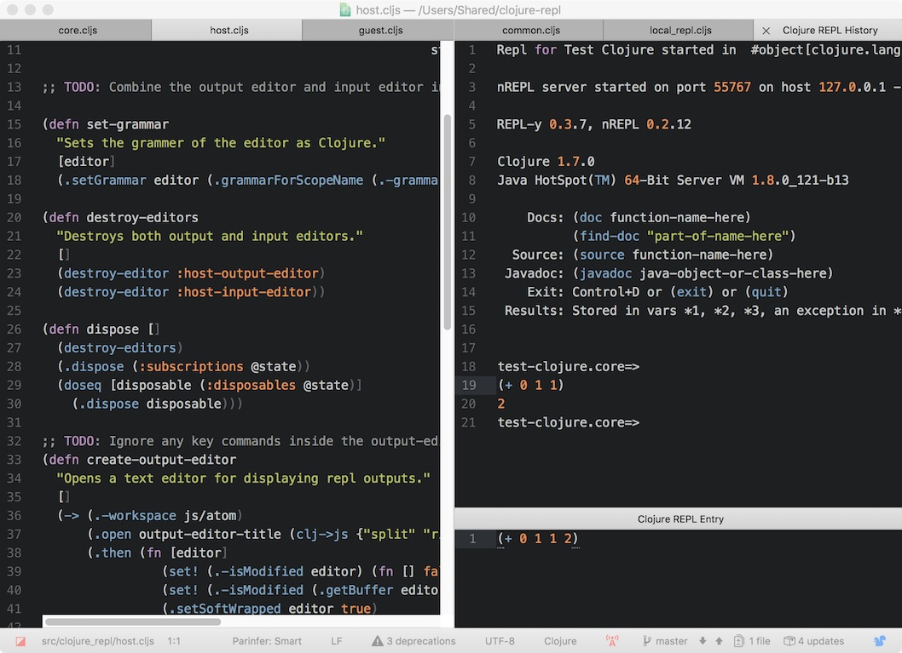

# Clojure Party REPL

Clojure REPL for Atom written in ClojureScript with full Teletype support for pair programming. Let's party! 😄




## How to use this
Open or add your project folder inside Atom, and follow one of the methods below:

Start a local nREPL with Leiningen:
1. Open a file in the project folder, and focus on the file so it has a blinking cursor.
2. Go to Atom's menu bar and select Packages -> Clojure Party Repl -> Start Local REPL
3. Make sure `lein` command is available and there's `project.clj` in the root directory.

Connect to a remote nREPL server:
1. Have a running nREPL ready to be connected.
2. Go to Atom's menu bar and select Packages -> Clojure Party Repl -> Connect to Remote nREPL server
3. Fill out the pop out panel and hit an Enter key to connect.

Once it's connected to the REPL, there should be two new tabs called `Clojure Party REPL History` and `Clojure Party REPL Entry`. The History tab shows all the output from the REPL, and the Entry tab is where you can type in code to send over to the REPL.

When you're done with the REPL, simply close the tab and the REPL will be disconnected.


Send code to a REPL using the following methods:
- Type in the code you want to send over to the REPL inside the Entry tab and hit Command-Enter keys.
- Move a cursor in any part of the code in a file inside a project and hit Command-Enter keys.
- Select code in a file that's inside a project and hit Command-Enter keys.
- Send code from an unsaved/untitled file and hit Command-Enter keys.

If Command-Enter keys aren't working, other packages' keybindings could be conflicting with Party Repl's. Check if your keybindings for Atom is working right. Go to Atom -> Keymap... to open `keymap.cson` and follow the instructions.


Pair programming with REPLs
Install teletype and share both `Clojure Party REPL History` and `Clojure Party REPL Entry` tabs. That's it, and now everybody shares the state of the running project!


## How it works
TODO


## Development
Wanna help polish this turd? Sweet! This package is built using shadow-cljs to make development easier supporting both:

- Hot code reloading. As you change the plugin's code, it will be dynamically reloaded so there's no need to refresh Atom.
- A full ClojureScript REPL into Atom, so you can REPL into the package and even inspect objects inside Atom.


### Install Shadow CJLS
First, install the Shadow CLJS node package somewhere on your $PATH:

```
npm install shadow-cljs
```


### Compiling our CLJS with auto code-reloading
Compile using one of the methods below:

To compile with an auto code-reloading loop with REPL, use:

```
shadow-cljs watch app
```

To compile without a code-reloading loop, use:

```
shadow-cljs compile app
```

To compile for release with `:simple` optimizations, use:

```
shadow-cljs release app
```

The first time you run shadow-cljs it will ask you to install stuff into the
project directory. This is ok, it's all blocked by `.gitignore`.

After running this you should see compiled JS dropped into the standard `lib` folder.

When using the shadow-cljs' `watch` mode, most changes will be automatically
reloaded such as changes to ClojureScript functions and vars, however changes to menus and
things on Atom's side will still require a refresh with View -> Developer -> Reload Window.


### Linking the plugin to Atom
After you compiled the plugin, run:

```
apm install
apm link
```

Next, restart Atom so it will notice the newly linked package. We just created a symlink
from `~/.atom/packages/clojure-party-repl` to your project path.

After restarting Atom, you should see the clojure-party-repl plugin installed and be able to use it.


### REPLing into the running project
Now that the package is installed, check the `shadow-cljs watch app` output and look for a message saying
`"JS runtime connected"`. This means it made contact with our package running in Atom. Now we can
REPL in. This can be finicky, if you don't see the message, try reloading Atom again.

Next, while shadow-cljs is running, in another terminal run:

```
$ shadow-cljs cljs-repl app
```

This will connect you directly into the plugin so you can live develop it. You can exit the REPL by typing `:repl/quit`

Once we add CLJS support, you'll be able to REPL into the package using itself. 🐵


### Testing and hacking on the clojure-party-repl
Now that we've got dynamic code-reloading and a ClojureScript REPL into Atom,
let's take this thing for a spin.

The easiest way to work on the plugin is to open a new Clojure project
in Atom in Dev Mode. If you don't have a dummy project around `lein new app test-project`
will make one. Open the new project by going to View -> Developer -> Open In Dev Mode,
and then open the development console View -> Developer -> Toggle Developer Tools to
show any possible errors preventing the plugin from starting.


### Adding new functionality to clojure-party-repl
The best place to start hacking is `core.clj`. This is where all
the public functions that do interesting stuff are defined and exported.

If you want to add something cool, follow the pattern in `core.clj` and
add your function to `shadow-cljs.edn` too.

Exported functions can be linked to keybindings and menu items, checkout the standard
`keymaps` and `menus` directories.


## Roadmap

### Core features
- [x] Write new nREPL client in ClojureScript
- [x] Support for Leiningen
- [ ] Support for Boot
- [x] Support for remote nREPLs
- [ ] Support for Socket REPLs (clojure.core style REPLs)
- [ ] unRepl support *(in progress)*
- [ ] Add line number and file metadata to stacktraces.
- [ ] ClojureScript support


### Pair programming / Teletype support
- [ ] Use Teletype to send messages between the host and guest.
- [ ] Sync the REPL history between the host and the guest.
- [ ] Find a better way to link the REPL editors between the host and guest. Right now they are just linked by the title like “REPL Entry”, but this limits us to just 1 REPL over Teletype at a time.
- [ ] Find a way to gracefully open both the input-editor and output-editor (history) editors at once on the guest’s side when the host clicks in either one. For example trick Teletype to sending both editors over to the guest at the same time.


### Using multiple REPLs simultaneously support
- [x] When executing code from a file, find which project the file is in, and run the code in the REPL that corresponds to that project. Otherwise, fall back to the last used REPL.
- [x] Add the project name to the title of the REPL editors
- [x] When an user sends code from an untitled/unsaved file, it should be sent to the current REPL.


### User interface improvements
- [ ] Integrate with Atom IDE
- [x] When executing code, temporarily highlight the top-level form or the selected code being sent to the REPL. Likewise, somehow indicate when there's a syntax error preventing a top-level form from being found.
- [ ] Create a new kind of Pane which holds both the REPL input-editor and output-editor.
- [ ] Add buttons to REPL Pane like "Execute" and "Clear history".
- [ ] Make the "Execute" button dynamically switch to "Cancel" when a long running command is executed (this should work seamlessly on the guest side too).
- [ ] Make the output-editor (history) read-only.


### OS support
- [x] macOS support
- [x] Linux support
- [ ] Windows support, probably not going to do it. PRs welcome.


### Polish
- [x] Add support for multiple Atom projects. When starting a REPL either start it in the project for the current file, or prompt the user and ask which file.
- [x] Add support for multiple remote REPLs. When starting a REPL prompt the user and ask which project.
- [ ] Update our namespace detection regex to allow for all valid characters in a namespace: include $=<>_
- [ ] Only allow one command to execute at a time. If we execute code in the REPL, either from a file or directly from the input-editor, it should show a spinner in the REPL UI and ignore the command.
- [ ] Compile out a release version with advanced optimizations and all of the REPL/dynamic reloading shadow-cljs features turned off.


### Errors
- [ ] Fix error “Pane has been destroyed at Pane.activate” when REPL TextEditor is the only item in a Pane.
- [ ] Fix error “TypeError: Patch does not apply at DefaultHistoryProvider.module.exports.DefaultHistoryProvider.getSnapshot <- TextBuffer.module.exports.TextBuffer.getHistory”


### Possible future ideas
- [ ] Stop multiplexing stdout/stderr and REPL results through the output-editor (history). Add a 3rd collapsable editor which
is dedicated to stdout/stderr. Additionally, add an option to
hook into all stdout/err streams on a remote socket REPL, so
all output can be seen even from other threads.
- [ ] The ability to add breakpoints or wrap seamless print statements around blocks of code. These would be a first-class UI feature, imagine a purple box wrapped around code that would print it out, every time
- [ ] Create a custom Atom grammar for the REPL history editor, ideally this would draw horizontal lines between each REPL entry.


## Contributors (alphabetical)
- [Aaron Brooks](https://github.com/abrooks)
- [Chris Houser](https://github.com/Chouser)
- [Hans Livingstone](https://hanslivingstone.com)
- Tomomi Livingstone


## License
Copyright 2018 Tomomi Livingstone.

Distributed under the Eclipse Public License, the same as Clojure.

Balloon icon made by [Freepik](https://www.freepik.com) from [Flaticon](https://www.flaticon.com), licensed under [CC 3.0 BY](https://creativecommons.org/licenses/by/3.0).
